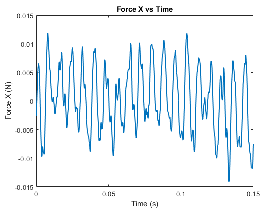
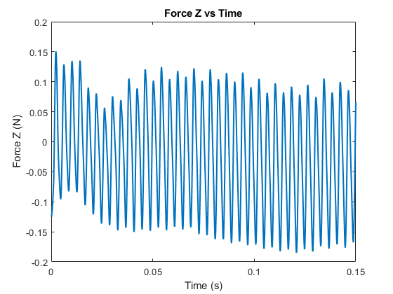

# Quadcopter RBM Simulation

This project demonstrates a CFD simulation of a quadcopter using **Rigid Body Motion (RBM)** to model spinning rotors and visualize wake dynamics. 785 rad/sec.

## Downwake Preview

## Simulation Gif

---

| Force X | Force Y (Lifting) | Force Z |
|------------------------|-------------------|--------------------|
|  |  |  |

### Combined Moments

---

## 🧠 Simulation Details

- 4 rotors modeled with RBM (2 CW, 2 CCW)
- Simulated using HPC resources
- Ran on a multi-node Linux-based cluster
- Batch-submitted using SLURM scripting
- Overset mesh for spinning rotor regions
- Wake behavior and stability analysis
