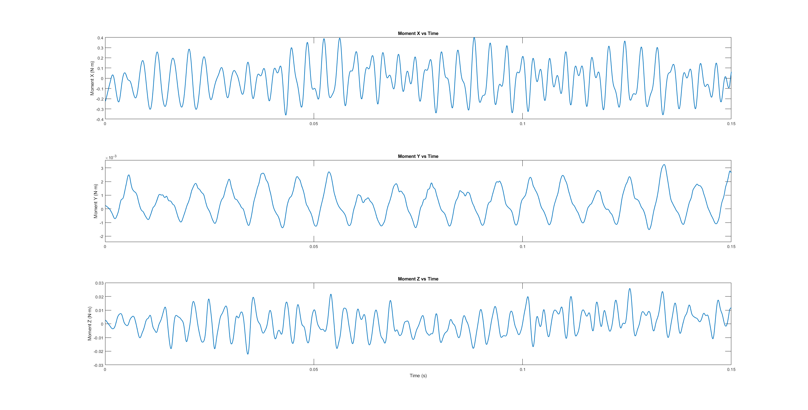

# Quadcopter RBM Simulation

This project demonstrates a CFD simulation of a quadcopter using **Rigid Body Motion (RBM)** to model spinning rotors and visualize wake dynamics.

## Simulation Preview

---

## 📊 Force and Moment History

| Lifting Force       | Side Force         |
|---------------------|--------------------|
|  |  |

### Combined Moments

---

## 🧠 Simulation Details

- 4 rotors modeled with RBM (2 CW, 2 CCW)
- Overset mesh for spinning rotor regions
- Wake behavior and stability analysis
